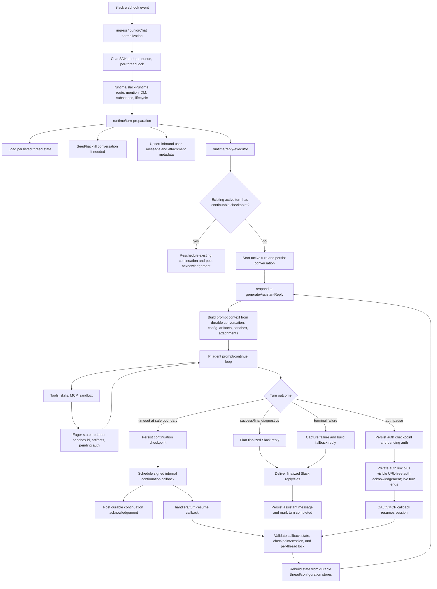

# Chat Architecture Spec

## Metadata

- Created: 2026-03-21
- Last Edited: 2026-05-28

## Changelog

- 2026-03-21: Defined the canonical chat architecture boundaries, service injection rules, and migration sequence away from runtime globals.
- 2026-03-22: Expanded the core interface contracts, terminology rules, and remaining cutover requirements for ingress, queue dispatch, capabilities, plugins, and eval harnesses.
- 2026-03-22: Cut queue processing over to an explicit injected dispatcher under `queue/` and moved production singleton assembly under `app/production.ts`.
- 2026-03-22: Added engineering principles for naming, interface size, and local clarity.
- 2026-03-22: Moved canonical ingress routing and chat bindings under `chat/ingress/*` and deleted the old `chat-background-patch.ts` module.
- 2026-03-22: Removed test-only plugin registry mutation APIs and made plugin discovery reload from the current root signature instead of import-time state.
- 2026-03-22: Replaced prototype-patch ingress with the explicit `JuniorChat` subclass, removed the OAuth resume post-message observer global, split queue transport from queue retry policy, and replaced the ambient user-token-store singleton with construction at the call site.
- 2026-05-09: Added the enforced service-to-Slack boundary: domain services depend on injected Slack-backed ports instead of Slack infrastructure modules.
- 2026-05-10: Added the enforced Slack-to-runtime boundary and moved resumed Slack turn orchestration under `runtime/`.
- 2026-05-13: Added the agent turn data-flow diagram, data ownership table, and spec ownership boundaries for continuation recovery.
- 2026-05-21: Clarified that Pi execution history is sourced from Redis-backed Pi session state, while thread state stores visible transcript plus session pointers.
- 2026-05-28: Linked agent-loop tool failure handling to the canonical agent execution contract.

## Status

Active

## Purpose

Define the normative architecture contract for `packages/junior/src/chat` so new work converges on explicit composition, small service interfaces, and maintainable test seams.

## Scope

- File-tree structure and responsibility boundaries for `packages/junior/src/chat`.
- Runtime/service/state composition rules.
- Test and eval seams for chat runtime behavior.

## Non-Goals

- Re-specifying user-facing Slack product behavior already covered by runtime, OAuth, queue, and testing specs.
- Forcing immediate directory moves for every legacy module before the cutover is complete.

## Engineering Principles

- Optimize for obvious code over flexible-but-indirect abstractions.
- Keep public interfaces small and intention-revealing; add a new seam only when there is clear reuse or a real boundary.
- Let file and module structure carry context so names do not have to repeat it.
- Keep exported names specific to their role; keep local helper names short when the surrounding file already provides context.
- Prefer domain language over mechanism language; if a name sounds like transport or wiring rather than product behavior, it is probably the wrong level.
- If a function or type name keeps growing qualifiers to stay understandable, split the module boundary instead of extending the name again.

## Contracts

### Agent Turn Data Flow

The core architecture is the flow of one Slack event through a durable agent turn. Module boundaries exist to keep this flow explicit and recoverable; they are not the primary architecture by themselves.



Normative rules:

1. Ingress normalizes events and hands them to queue/runtime. It must not decide agent behavior.
2. The Chat SDK queue/lock layer handles transport-level concerns such as duplicate inbound delivery, ordering, and lock serialization. It is not the source of truth for agent recovery.
3. Turn preparation is the only point that converts an inbound Slack message into persisted conversation context for an agent turn.
4. `respond.ts` is the only owner of Pi agent execution, prompt/continue selection, timeout detection, and safe-boundary checkpoint creation.
5. Tool calls and tool failures are internal agent-loop data until the assistant produces final turn diagnostics. Tool execution errors must be captured, but they are not automatically terminal user replies. Model-repairable failures must use the tool-error semantics from [Agent Execution Discipline Spec](./agent-execution-spec.md).
6. User-visible assistant text is posted only after the reply is finalized and planned for Slack delivery.
7. Final turn success is defined by Slack accepting the visible final reply, not by model generation completing.
8. Agent recovery is session continuation: reload durable thread state plus the latest safe turn checkpoint, then continue the same session. It must not create a second active turn or re-run from transient process memory.
9. Serverless timeout handling is one producer of continuation checkpoints. It is a proactive accommodation for Vercel execution limits, not the general recovery architecture.
10. Acknowledgement messages, assistant status, and logs are observability/UX surfaces. They never substitute for checkpointed recovery or final reply delivery.

Data authority by stage:

| Data                                     | Authority                                          | Notes                                                                                                            |
| ---------------------------------------- | -------------------------------------------------- | ---------------------------------------------------------------------------------------------------------------- |
| Slack event shape                        | `ingress/` and Slack adapter payloads              | Normalize IDs and attachments before runtime; do not infer behavior here.                                        |
| Queue ordering and duplicate suppression | Chat SDK state adapter lock/queue                  | Prevent concurrent handler execution, but do not rely on queue memory for turn recovery.                         |
| Conversation transcript                  | Persisted thread state                             | Source for visible user/assistant thread history; assistant messages are added only after final Slack delivery.  |
| Active turn identity                     | `conversation.processing.activeTurnId`             | Points to the turn session that owns the thread until completion, auth handoff, failure, or supersession.        |
| Last completed session identity          | `conversation.processing.lastSessionId`            | Points fresh turns at the latest completed Pi session when available.                                            |
| Pi execution transcript                  | Pi session state in the state cache                | Stores stable Pi messages incrementally plus checkpoint cursors; not a replacement for visible Slack transcript. |
| Sandbox/artifact state                   | Persisted thread state                             | Persist eagerly as it changes so a resumed slice can rebuild the same runtime world.                             |
| Pending auth                             | Thread-local processing state plus auth checkpoint | Auth pauses end the live turn after private link delivery and are resumed by callback.                           |
| Final Slack reply                        | Slack thread post acceptance                       | Completion is persisted only after Slack accepts the final visible reply.                                        |
| Continuation acknowledgement             | Slack thread post                                  | User-facing status only; does not complete the turn.                                                             |

Related contract ownership:

| Spec                                   | Owns                                                                                          |
| -------------------------------------- | --------------------------------------------------------------------------------------------- |
| `./chat-architecture-spec.md`          | End-to-end turn data flow, data authority, and module boundaries.                             |
| `./agent-session-resumability-spec.md` | Checkpoint schema, Pi `continue()` semantics, timeout callback safety, and session lifecycle. |
| `./slack-agent-delivery-spec.md`       | Slack entry surfaces, progress UX, continuation acknowledgements, and final reply delivery.   |
| `./slack-outbound-contract-spec.md`    | Slack API write boundary, formatting, file upload, reactions, and Slack error mapping.        |

### File Tree Responsibilities

- `app/`: composition roots only. Build concrete implementations and assemble runtime instances.
- `ingress/`: inbound event normalization, classification, and queue handoff only.
- `runtime/`: turn orchestration only.
- `services/`: domain services with injected collaborators.
- `state/`: adapter selection plus store modules split by concern.
- `slack/`: Slack-specific client, output formatting, and channel/user helpers.
- `ai/`: provider-facing AI clients.
- `queue/`: queue transport and queue worker orchestration.
- `turn/`: turn lifecycle state and resumability.
- `tools/`, `plugins/`, `capabilities/`, `sandbox/`: domain-specific integrations that consume the above boundaries.

### Import Direction Rules

- `app/` may import any chat module needed to assemble the runtime.
- Non-`app/` modules must not import from `app/`.
- `runtime/` may depend on `services/`, `state/`, `queue/`, `turn/`, `slack/`, and pure helpers.
- `services/` must not depend on `runtime/`.
- `services/` must not import Slack infrastructure; use small injected ports owned by the service when a domain service needs Slack-backed data or files.
- `slack/` modules must not import runtime orchestration modules.
- `state/` must not depend on `runtime/` or service modules.
- `ingress/` may route into queue/runtime entrypoints, but must not own business logic that belongs in `runtime/` or `services/`.

**Verification:** `pnpm run test:arch-boundary` enforces these rules via static import analysis.

### Service Interface Rules

- Do not use mutable runtime service globals or singleton mutation APIs for behavior seams.
- Do not introduce broad deps bags or service locators for runtime behavior.
- Prefer small consumer-owned interfaces that describe one responsibility.
- Default production implementations may live beside a service, but composition roots must be able to construct explicit service instances.
- Do not leak third-party SDK types across subsystem boundaries when a small local interface will do. Infrastructure modules may use vendor SDKs internally, but higher layers should depend on local contracts.

### Core Interface Targets

The following boundaries are the canonical interfaces for the chat runtime. New work must converge on these shapes even if legacy files still exist during cutover.

#### Runtime Composition Root

- One composition root creates the concrete Slack chat app runtime for production.
- Production singleton assembly belongs under `app/` rather than worker or runtime modules.
- One thin test fixture may create local runtime instances for tests and evals.
- Queue workers, ingress routers, and handlers must depend on a runtime instance or runtime factory, not import the production singleton.

Target role:

```ts
interface ChatRuntimeFactory {
  create(options?: RuntimeOverrides): ChatTurnRuntime;
}
```

#### Turn Runtime

- The turn runtime owns message-handling orchestration for mentions, subscribed-thread messages, and assistant lifecycle events.
- It may depend on services, state stores, and observability, but must not depend on ingress transport or queue clients.

Target role:

```ts
interface ChatTurnRuntime {
  handleMention(thread, message, hooks?): Promise<void>;
  handleSubscribedMessage(thread, message, hooks?): Promise<void>;
  handleAssistantThreadStarted(event): Promise<void>;
  handleAssistantContextChanged(event): Promise<void>;
}
```

#### Ingress Router

- Ingress owns event normalization, dedupe, thread-kind classification, and queue handoff.
- Chat SDK compatibility should be expressed through an explicit `Chat` subclass or wrapper, not prototype mutation or import-side effects.
- Ingress must not become a second authority for turn behavior that already belongs in runtime.
- Canonical ingress code lives under `chat/ingress/*`. Do not reintroduce legacy patch modules for core ingress behavior.

Target role:

```ts
interface MessageIngressRouter {
  route(event, deps): Promise<IngressRouteResult>;
}
```

#### Queue Dispatcher

- The queue worker owns serialization, locking, ordering, and retry interaction.
- Queue dispatch into the turn runtime must be an injected boundary.
- Queue worker code must not import the production bot singleton.
- Provider transport should stay behind a local queue transport module so retry policy and handler semantics remain project-owned.

Target role:

```ts
interface QueuedMessageDispatcher {
  dispatch(payload, runtime): Promise<void>;
}
```

#### Capability And Plugin Catalog

- Capability and plugin discovery are runtime services, not ambient global registries.
- Test or eval-only plugin roots must be provided through local fixtures or composition-bound catalogs, not module-level global mutation.
- Environment-driven mode switches must be isolated to composition roots.
- Token stores should be created from the current state adapter at the call site or injected factory boundary, not hidden behind ambient module singletons.

Target role:

```ts
interface PluginCatalog {
  listProviders(): PluginProvider[];
  listMcpProviders(): PluginProvider[];
  getOAuthConfig(provider): OAuthConfig | undefined;
}

interface ProviderCredentialIssuer {
  issueLease(args): Promise<CredentialLease>;
}
```

#### Eval Scenario Harness

- The eval harness may replace transport, auth completion, and reply generation with local fixtures.
- The eval harness must not become a second runtime architecture.
- Harness overrides should be scenario-oriented and map to real runtime seams rather than adding arbitrary knobs.

Target role:

```ts
interface EvalScenarioRunner {
  run(caseDef): Promise<UserVisibleArtifacts>;
}
```

### State Rules

- State access must be split by concern rather than kept in one kitchen-sink module.
- Adapter/backend selection belongs in the adapter layer.
- Key-building, TTL policy, and persistence rules belong in store modules.
- Consumers should import the narrowest store they need rather than routing all access through a broad facade.
- Per-thread Chat SDK locks use a short renewable state-adapter lease. Live workers heartbeat the lease while processing; if a worker disappears, the lease must expire quickly enough for a retry or continuation callback to acquire ownership.

### Turn Continuation Recovery

Turn continuation recovery covers any case where Junior has a durable safe resume boundary but does not know whether the active turn reached final Slack delivery: serverless timeout, lost or duplicate callback, transport retry, or user follow-up while `activeTurnId` still points at an awaiting checkpoint.

Rules:

1. Recovery continues the existing session from durable thread state plus the latest safe agent-session cursor. It must not start a second active turn for a thread with an awaiting continuation checkpoint.
2. Chat SDK retry, dedupe, queueing, and per-thread locking protect inbound delivery. They do not replace session continuation because they do not carry Pi session state, sandbox/artifact state, pending auth, or final Slack delivery state.
3. `respond.ts` creates safe checkpoints; `runtime/reply-executor.ts` schedules or reschedules continuation; `handlers/turn-resume.ts` validates callback version and lock ownership; `runtime/slack-resume.ts` reuses the normal final-delivery path.
4. Continuation acknowledgements are Slack UX only. They do not complete the turn and are not a recovery mechanism.
5. Lock-busy callback retry is bounded. There is no durable sweeper today, so retry exhaustion reschedules the same signed callback for the current checkpoint version rather than completing or abandoning the turn.

### Test And Eval Rules

- Tests and evals must instantiate local runtimes through composition roots or thin fixtures over them.
- Prefer `vi.spyOn(...)` or narrow service overrides at real module boundaries over new production test hooks.
- Do not mutate the production singleton runtime to drive behavior tests.
- Message evals must exercise the real ingress and queue worker path, with only the external transport replaced by an in-memory shim.

### Terminology Rules

- Use domain-role names, not mechanism names.
- Prefer names that are easy to read in local context over names that encode the whole call path.
- Avoid `patch` in canonical module names for core runtime behavior.
- Avoid `behavior` for generic harness override bags; prefer `scenario`, `fixture`, or `overrides`.
- Use `runtime` only for actual turn/lifecycle orchestration layers, not for thin wrappers or helpers.
- Use `dispatcher` for queue-to-runtime handoff and `router` for ingress decision/routing.
- Avoid `app` as a prefix for modules inside `src/chat` unless the module is specifically a composition root.

Current names that should be treated as transitional:

- None in the core runtime path. New runtime naming should follow the `slackRuntime` / `createSlackRuntime` / `SubscribedReplyDecision` / `AssistantLifecycleEvent` vocabulary now in the tree.

### Remaining Cutover Requirements

The following conditions are still architectural debt and should be treated as non-end-state:

1. Plugin and capability discovery still flow through a default module-level catalog cache instead of fully injected catalogs.
2. Eval harness still owns too many environment and runtime control knobs.
3. Legacy compatibility exports like `botConfig` still exist; new code should prefer explicit config readers when it needs more than one value or subsystem.

### Migration Sequence

1. Document the contract in `AGENTS.md` and canonical specs.
2. Replace runtime-global behavior seams with injected services.
3. Split state into adapter + concern-specific stores.
4. Remove singleton-only queue dispatch and move runtime assembly fully behind explicit factories.
5. Replace prototype-patch ingress with an explicit ingress router boundary.
6. Replace plugin/capability registries with composition-bound catalogs and factories.
7. Shrink harness and remaining test hooks to local runtime fixtures or boundary spies.

Legacy modules may remain during cutover, but new code must follow this contract and refactors should delete old seams rather than preserve them.

## Failure Model

- Adding new mutable runtime test hooks, service locators, or broad deps bags is a contract violation.
- Hiding business logic in ingress wrappers, state adapters, or singleton bootstrap modules is a contract violation.
- Queue or worker code importing the production singleton runtime is a contract violation.
- Prototype mutation or import-side-effect wiring as the canonical ingress model is a contract violation.
- Duplicating reply-decision authority across ingress and runtime is a contract violation.
- If a change needs a new seam, prefer a local factory/service interface; if it cannot be expressed that way, stop and update this spec first.

## Observability

- Observability ownership stays with the domain module doing the work; composition roots wire dependencies but should not add behavior-specific logging.
- Logging and tracing conventions remain governed by `specs/logging/index.md`.

## Verification

- `rg "getBotDeps|setBotDepsForTests|resetBotDepsForTests|runtime/deps"` should stay empty for production chat runtime code.
- Typecheck and focused tests must pass for any touched runtime/service/state path.
- Behavior changes to chat architecture must update this spec, `AGENTS.md`, and the relevant testing docs in the same change.

## Related Specs

- `./agent-session-resumability-spec.md`
- `./oauth-flows-spec.md`
- `./plugin-spec.md`
- `./testing/index.md`
