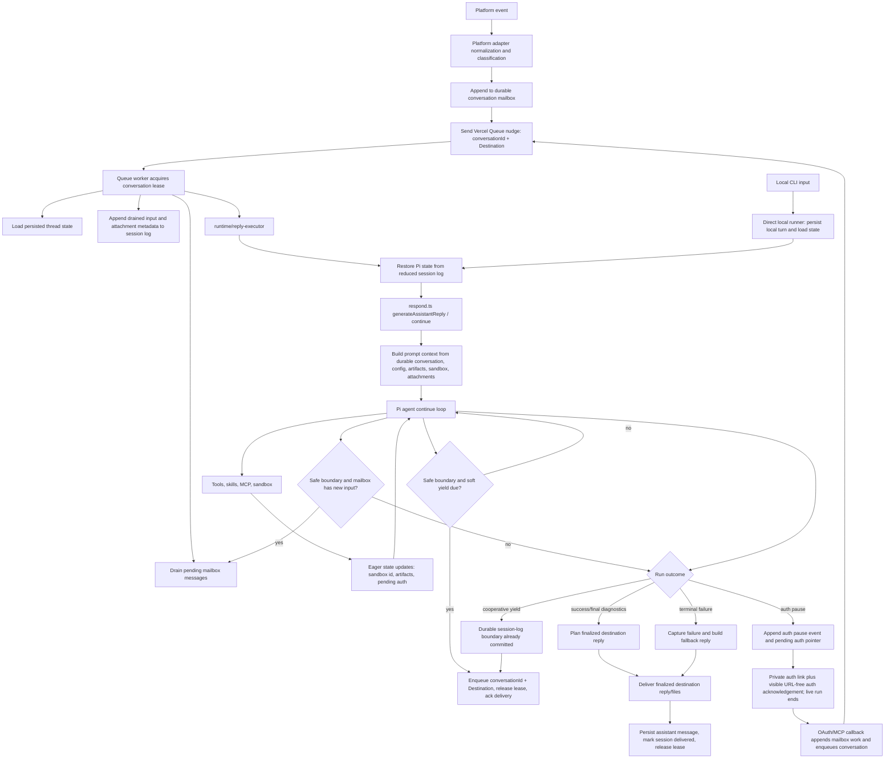

# Chat Architecture Spec

## Metadata

- Created: 2026-03-21
- Last Edited: 2026-06-11

## Purpose

Define the normative architecture contract for `packages/junior/src/chat` so new work converges on explicit composition, platform adapters, small service interfaces, and maintainable test seams.

## Scope

- File-tree structure and responsibility boundaries for `packages/junior/src/chat`.
- Runtime/service/state composition rules.
- Platform adapter boundaries for Slack, local CLI, and future message sources.
- Test and eval seams for chat runtime behavior.

## Non-Goals

- Re-specifying user-facing Slack product behavior already covered by runtime, OAuth, queue, and testing specs.
- Forcing immediate directory moves for every legacy module before the cutover is complete.

## Engineering Principles

- Optimize for obvious code over flexible-but-indirect abstractions.
- Keep public interfaces small and intention-revealing; add a new seam only when there is clear reuse or a real boundary.
- Let file and module structure carry context so names do not have to repeat it.
- Keep exported names specific to their role; keep local helper names short when the surrounding file already provides context.
- Prefer domain language over mechanism language; if a name sounds like transport or wiring rather than product behavior, it is probably the wrong level.
- If a function or type name keeps growing qualifiers to stay understandable, split the module boundary instead of extending the name again.

## Contracts

### Agent Run Data Flow

The core architecture is the flow of one platform event into a durable agent run.
Module boundaries exist to keep this flow explicit and recoverable; they are not
the primary architecture by themselves.



Normative rules:

1. Mailbox-backed platform adapters parse and classify source events, append them to the durable mailbox, and send a queue nudge. They must not decide agent behavior beyond source-specific routing such as Slack mention/subscribed classification.
2. The task execution layer owns queue wake-ups, conversation leases, worker check-ins, and heartbeat recovery. Chat SDK queue/lock semantics are not canonical.
3. The first-pass local CLI adapter uses the direct local runner from [Local Agent Spec](./local-agent.md). It must not claim mailbox-backed local source semantics until a local mailbox ingress contract exists.
4. The mailbox worker is the only point that drains inbound messages into persisted agent session context for mailbox-backed paths.
5. `respond.ts` is the only owner of Pi agent execution, prompt/continue selection, timeout detection, and safe-boundary session-log event creation.
6. Tool calls and tool failures are internal agent-loop data until the assistant produces final run diagnostics. Tool execution errors must be captured, but they are not automatically terminal user replies. Model-repairable failures must use the tool-error semantics from [Agent Execution Discipline Spec](./agent-execution.md).
7. User-visible assistant text is posted only after the reply is finalized and planned for destination delivery.
8. Final run success is defined by the destination delivery port accepting the visible final reply, not by model generation completing. Slack acceptance is one destination implementation.
9. Agent recovery is session continuation: reload durable thread state plus the reduced session log, then continue the same session. It must not create a second active run or re-run from transient process memory.
10. Cooperative yield at safe agent-loop boundaries is the normal accommodation for Vercel execution limits. Platform death is recovered by queue redelivery and heartbeat repair from the latest durable session boundary.
11. Assistant status and logs are observability/UX surfaces. They never substitute for persisted session recovery or final reply delivery.

Data authority by stage:

| Data                                    | Authority                                              | Notes                                                                                                                              |
| --------------------------------------- | ------------------------------------------------------ | ---------------------------------------------------------------------------------------------------------------------------------- |
| Platform event shape                    | Source adapter ingress modules                         | Parse platform IDs and attachments before runtime; do not infer agent behavior here.                                               |
| Queue wake-up and duplicate suppression | Conversation mailbox worker and lease                  | Queue messages are nudges; mailbox state and leases decide whether work exists and who may run it.                                 |
| Conversation reporting rows             | `ConversationStore` / `./conversation-storage.md`      | Source for dashboard/API conversation lists; do not rebuild the primary list by grouping agent-run rows.                           |
| Active execution discovery              | `conversation:active` index + conversation record      | Heartbeat discovers stale active conversations here, then uses the record to decide whether to enqueue a nudge.                    |
| Conversation transcript                 | Persisted thread state                                 | Source for visible user/assistant thread history; assistant messages are added only after final destination delivery.              |
| Active work routing                     | Conversation mailbox and lease                         | Pending messages are drained into the active conversation at safe boundaries for mailbox-backed paths.                             |
| Pi execution transcript                 | Junior agent session log keyed by conversation id      | Append-only model-execution log with a deterministic Pi-message projection; not a replacement for visible conversation transcript. |
| Sandbox/artifact state                  | Persisted thread state                                 | Persist eagerly as it changes so a resumed slice can rebuild the same runtime world.                                               |
| Pending auth                            | Auth-owned callback state plus session-log pause event | Auth pauses end the live run after private link delivery and are resumed by callback.                                              |
| Final destination reply                 | Destination delivery port acceptance                   | Completion is persisted only after the destination accepts the final visible reply.                                                |
| Routine continuation progress           | Assistant status and `reportProgress`                  | Cooperative yields do not post filler thread messages.                                                                             |

Related contract ownership:

| Spec                              | Owns                                                                                       |
| --------------------------------- | ------------------------------------------------------------------------------------------ |
| `./chat-architecture.md`          | End-to-end agent-run data flow, data authority, and module boundaries.                     |
| `./task-execution.md`             | Conversation mailbox, queue wake-up, lease, cooperative yield, and heartbeat repair.       |
| `./agent-session-resumability.md` | Session-log schema, Pi `continue()` semantics, and session lifecycle.                      |
| `./identity.md`                   | Actor, system actor, requester, author, creator, subject, and display identity separation. |
| `./slack-agent-delivery.md`       | Slack entry surfaces, progress UX, pause acknowledgements, and final reply delivery.       |
| `./slack-outbound-contract.md`    | Slack API write boundary, formatting, file upload, reactions, and Slack error mapping.     |

### File Tree Responsibilities

- `app/`: composition roots only. Build concrete implementations and assemble runtime instances.
- `ingress/`: inbound event parsing, classification, and queue handoff only.
- `runtime/`: agent-run orchestration only.
- `services/`: domain services with injected collaborators.
- `state/`: adapter selection plus store modules split by concern.
- `slack/`: Slack-specific client, output formatting, and channel/user helpers.
- Local CLI adapter code may live under `cli/` or a source-specific runtime module, but it must use the same platform adapter boundary as Slack.
- `ai/`: provider-facing AI clients.
- `queue/`: queue transport and queue worker orchestration.
- `turn/`: agent-run lifecycle state and resumability. The directory name is
  legacy until code paths are renamed.
- `tools/`, `plugins/`, `capabilities/`, `sandbox/`: domain-specific integrations that consume the above boundaries.

### Import Direction Rules

- `app/` may import any chat module needed to assemble the runtime.
- Non-`app/` modules must not import from `app/`.
- `runtime/` may depend on `services/`, `state/`, `queue/`, `turn/`, source-specific delivery ports, and pure helpers.
- `services/` must not depend on `runtime/`.
- `services/` must not import Slack infrastructure; use small injected ports owned by the service when a domain service needs Slack-backed data or files.
- `slack/` modules must not import runtime orchestration modules.
- `state/` must not depend on `runtime/` or service modules.
- `ingress/` may route into queue/runtime entrypoints, but must not own business logic that belongs in `runtime/` or `services/`.

**Verification:** `pnpm run test:arch-boundary` enforces these rules via static import analysis.

### Service Interface Rules

- Do not use mutable runtime service globals or singleton mutation APIs for behavior seams.
- Do not introduce broad deps bags or service locators for runtime behavior.
- Prefer small consumer-owned interfaces that describe one responsibility.
- Default production implementations may live beside a service, but composition roots must be able to construct explicit service instances.
- Do not leak third-party SDK types across subsystem boundaries when a small local interface will do. Infrastructure modules may use vendor SDKs internally, but higher layers should depend on local contracts.

### Core Interface Targets

The following boundaries are the canonical interfaces for the chat runtime. New work must converge on these shapes even if legacy files still exist during cutover.

#### Runtime Composition Root

- One composition root creates the shared conversation runtime.
- Source-specific composition roots wire Slack, local CLI, or another platform adapter into that shared runtime.
- Production singleton assembly belongs under `app/` rather than worker or runtime modules.
- One thin test fixture may create local runtime instances for tests and evals.
- Queue workers, ingress routers, and handlers must depend on a runtime instance or runtime factory, not import the production singleton.

Target role:

```ts
interface ChatRuntimeFactory {
  create(options?: RuntimeOverrides): ConversationRuntime;
}
```

#### Platform Adapter Boundary

- A platform adapter owns source-specific normalization and destination delivery only.
- Slack adapters own Slack-only concerns: signature verification, Slack ID parsing, mention stripping, subscribed-thread routing input, assistant lifecycle events, Slack profile lookup, Slack status, Slack files, Slack reactions, and Slack markdown/output formatting.
- Local CLI adapters own terminal input/output, local conversation selection, and optional local state configuration.
- Platform adapters must not call the Pi agent directly. They hand normalized input to the shared conversation runtime or append mailbox work for the shared worker.
- Platform adapters must not fabricate Slack-shaped requesters, destinations, or thread ids for non-Slack sources.

Target role:

```ts
interface ConversationPlatformAdapter<RawInput> {
  normalize(input: RawInput): Promise<NormalizedInboundMessage>;
  deliver(result: ConversationDeliveryResult): Promise<void>;
}
```

#### Runtime Boundary

- The shared runtime owns normalized message execution, conversation state preparation, Pi execution, safe-boundary continuation, and final result planning.
- It may depend on services, state stores, destination delivery ports, and observability, but must not depend on source HTTP transports or queue clients.
- Slack-specific runtime code may remain as a transitional adapter while the shared runtime is extracted, but new non-Slack behavior must not extend Slack runtime interfaces.

Target role:

```ts
interface ConversationRuntime {
  handleMessage(input: NormalizedInboundMessage, hooks?): Promise<void>;
}
```

#### Ingress Router

- Ingress owns source request verification, event parsing, source-specific classification, mailbox append, and queue handoff.
- Chat SDK must not own canonical ingress queueing, conversation locks, or long-running handler lifetime.
- Ingress must not become a second authority for agent-run behavior that already belongs in runtime.
- Canonical ingress code lives under `chat/ingress/*`. Do not reintroduce legacy patch modules for core ingress behavior.

Target role:

```ts
interface MessageIngressRouter {
  route(event, deps): Promise<IngressRouteResult>;
}
```

#### Queue Dispatcher

- The queue worker owns conversation lease acquisition, mailbox draining, cooperative yield, and retry interaction.
- Queue dispatch into the runtime must be an injected boundary.
- Queue worker code must not import the production bot singleton.
- Provider transport should stay behind a local queue transport module so retry policy and handler semantics remain project-owned.

Target role:

```ts
interface QueuedMessageDispatcher {
  dispatch(payload, runtime): Promise<void>;
}
```

#### Capability And Plugin Catalog

- Capability and plugin discovery are runtime services, not ambient global registries.
- Test or eval-only plugin roots must be provided through local fixtures or composition-bound catalogs, not module-level global mutation.
- Environment-driven mode switches must be isolated to composition roots.
- Token stores should be created from the current state adapter at the call site or injected factory boundary, not hidden behind ambient module singletons.

Target role:

```ts
interface PluginCatalog {
  listProviders(): PluginProvider[];
  listMcpProviders(): PluginProvider[];
  getOAuthConfig(provider): OAuthConfig | undefined;
}

interface ProviderCredentialIssuer {
  issueLease(args): Promise<CredentialLease>;
}
```

#### Eval Scenario Harness

- The eval harness may replace transport, auth completion, and reply generation with local fixtures.
- The eval harness must not become a second runtime architecture.
- Harness overrides should be scenario-oriented and map to real runtime seams rather than adding arbitrary knobs.

Target role:

```ts
interface EvalScenarioRunner {
  run(caseDef): Promise<UserVisibleArtifacts>;
}
```

### State Rules

- State access must be split by concern rather than kept in one kitchen-sink module.
- Adapter/backend selection belongs in the adapter layer.
- Key-building, TTL policy, and persistence rules belong in store modules.
- Consumers should import the narrowest store they need rather than routing all access through a broad facade.
- Conversation execution leases use a short renewable state-adapter lease. Live workers check in while processing; if a worker disappears, the lease must expire quickly enough for heartbeat or queue redelivery to re-enqueue the conversation.

### Agent Run Continuation Recovery

Agent run continuation recovery covers any case where Junior has a durable safe
resume boundary but does not know whether the active run reached final
destination delivery: serverless timeout, lost or duplicate queue nudge, worker
death, transport retry, or user follow-up while the conversation is active.

Rules:

1. Recovery continues the existing conversation from durable thread state plus the reduced agent-session log keyed by the predictable conversation id. It must not start a second active run for the same conversation.
2. Conversation mailbox state, queue wake-ups, and leases protect inbound delivery. They do not replace session continuation because they do not carry Junior's canonical agent session log, sandbox/artifact state, pending auth, or final destination delivery state.
3. `respond.ts` appends safe session-log boundaries; the mailbox worker enqueues cooperative continuations; heartbeat re-enqueues expired leases and stranded pending mailbox work.
4. Routine cooperative continuation does not create a platform acknowledgement message. Assistant status and `reportProgress` own progress UX.
5. Queue duplicate and active-lease cases are harmless because queue messages are conversation wake-up nudges, not canonical work records.

### Test And Eval Rules

- Tests and evals must instantiate local runtimes through composition roots or thin fixtures over them.
- Prefer `vi.spyOn(...)` or narrow service overrides at real module boundaries over new production test hooks.
- Do not mutate the production singleton runtime to drive behavior tests.
- Message evals must exercise the real ingress and queue worker path, with only the external transport replaced by an in-memory shim.

### Terminology Rules

- Use domain-role names, not mechanism names.
- Prefer names that are easy to read in local context over names that encode the whole call path.
- Avoid `patch` in canonical module names for core runtime behavior.
- Avoid `behavior` for generic harness override bags; prefer `scenario`, `fixture`, or `overrides`.
- Use `runtime` only for actual agent-run/lifecycle orchestration layers, not for thin wrappers or helpers.
- Use `dispatcher` for queue-to-runtime handoff and `router` for ingress decision/routing.
- Avoid `app` as a prefix for modules inside `src/chat` unless the module is specifically a composition root.

Current names that should be treated as transitional:

- `slackRuntime` / `createSlackRuntime` are Slack adapter names, not names for the shared conversation runtime.
- New shared runtime naming should use `conversation`, `platform`, `source`, `destination`, `delivery`, and `adapter` vocabulary rather than Slack-specific nouns.

## Failure Model

- Adding new mutable runtime test hooks, service locators, or broad deps bags is a contract violation.
- Hiding business logic in ingress wrappers, state adapters, or singleton bootstrap modules is a contract violation.
- Queue or worker code importing the production singleton runtime is a contract violation.
- Prototype mutation or import-side-effect wiring as the canonical ingress model is a contract violation.
- Duplicating reply-decision authority across ingress and runtime is a contract violation.
- If a change needs a new seam, prefer a local factory/service interface; if it cannot be expressed that way, stop and update this spec first.

## Observability

- Observability ownership stays with the domain module doing the work; composition roots wire dependencies but should not add behavior-specific logging.
- Logging and tracing conventions remain governed by `specs/instrumentation.md`.

## Verification

- `rg "getBotDeps|setBotDepsForTests|resetBotDepsForTests|runtime/deps"` should stay empty for production chat runtime code.
- Typecheck and focused tests must pass for any touched runtime/service/state path.
- Behavior changes to chat architecture must update this spec, `AGENTS.md`, and the relevant testing docs in the same change.

## Related Specs

- `./task-execution.md`
- `./local-agent.md`
- `./agent-session-resumability.md`
- `./oauth-flows.md`
- `./plugin.md`
- `./testing.md`
