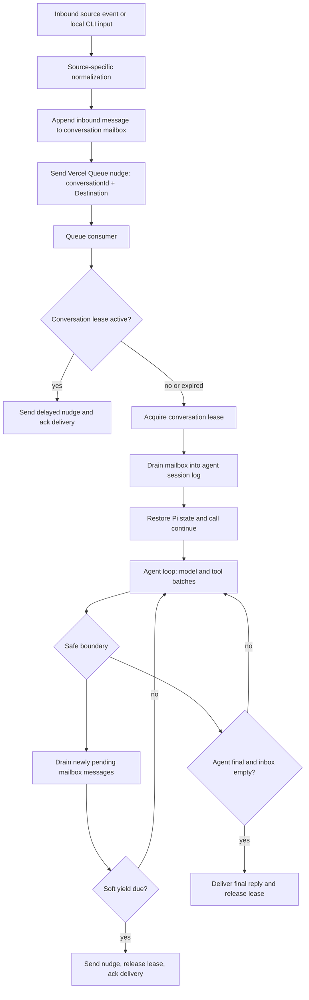

# Task Execution Spec

## Metadata

- Created: 2026-06-01
- Last Edited: 2026-06-12

## Purpose

Define Junior's durable execution contract for serverless runtimes where any
function invocation may disappear, time out around 300 seconds, or receive
duplicate queue deliveries.

The system exists so inbound work is not lost, active conversations recover
without user pings, and long agent loops can continue across fresh serverless
invocations without turning every tool call into a queue round trip.

## Scope

- Durable conversation mailboxes for inbound work.
- Vercel Queue wake-up messages.
- Conversation-scoped leases and worker check-ins.
- Cooperative agent-loop yielding at safe Pi continuation boundaries.
- Heartbeat repair for expired leases and stranded mailbox work.
- The boundary between source-specific adapters and generic agent execution.
- First-pass migration away from Chat SDK queue, lock, and long-running handler
  ownership.

## Non-Goals

- A generic workflow engine.
- A durable task database with task records, checkpoint references, child task
  state machines, or slice counters.
- Queueing every model call or every tool call as a separate asynchronous task.
- Exactly-once external side-effect delivery.
- Mid-model-stream or mid-tool-call checkpointing.
- Owning model-execution poison-work policy. Timeout slice caps belong to
  `./agent-session-resumability.md`; this layer only requeues or releases
  conversation work based on durable runnable state.
- Using Slack thread messages as progress filler for routine continuation.

## Contracts

### Terminology

The durable execution model uses the canonical terms from
[`terminology.md`](./terminology.md). In this spec:

- **Conversation**: the thread-level or session-level container identified by
  `conversationId`. For Slack, this is a normalized thread identity such as
  `slack:<channel_id>:<thread_ts>`. For local CLI, this is a normalized local
  session identity such as `local:<workspace_key>:<conversation_slug>`.
- **Inbound message**: one normalized source event that should be made
  available to the agent. Slack messages, local CLI prompts, scheduler prompts,
  and plugin dispatch prompts all become inbound messages.
- **Agent run**: one response-producing execution for a conversation. A run may
  consume multiple inbound messages at safe boundaries, call many tools, and
  span multiple serverless invocations before final delivery.
- **Execution slice**: one serverless invocation segment of an agent run.
- **Agent step**: a model/tool/action event represented inside the durable
  transcript/session log. The execution layer does not index steps.
- **Conversation execution**: the mutable operational state for one
  conversation: pending inbound mailbox, worker lease, nudge/checkpoint
  timestamps, and whether the conversation is idle or active.

Avoid using **turn** for agent runs in new specs and storage names. If a test,
module, or existing key still says "turn session", read it as the historical
name for an agent-run read model, not as a single model/tool action.

This spec follows the domain naming policy in
[`policies/interface-design.md`](../policies/interface-design.md). Its core
nouns are `Conversation`, `Source`, `Destination`, `InboundMessage`,
`AgentInput`, `AgentRun`, `ExecutionSlice`, `AgentStep`, `Lease`, and
`Requester`. Use `Source` for where input came from and `Destination` for where
Junior should send output.

### Architecture Summary

Junior uses a durable conversation mailbox plus a queue wake-up nudge.



Normative rules:

1. Durable mailbox state is the source of truth for pending inbound work.
2. Vercel Queue messages are wake-up nudges only. Their payload is
   `{ conversationId, destination }`.
3. Queue delivery is at-least-once. Duplicate nudges must be cheap and safe.
4. A worker may execute a conversation only while holding the conversation
   lease.
5. The agent session log is the checkpoint. No task payload should name a
   checkpoint or resume position.
6. Continuation means loading the latest durable conversation/session state and
   calling Pi `continue()`.
7. Routine continuation must be silent on platforms where the delivery adapter
   owns progress UX. The agent-owned `reportProgress` path and destination
   status/progress port own user-visible progress.

### Identity Model

`conversationId` is the execution key. For Slack, it must be a stable normalized
thread identity such as `slack:<channel_id>:<thread_ts>`. For local CLI, it must
be a stable normalized session identity such as
`local:<workspace_key>:<conversation_slug>`.

`inboundMessageId` is the idempotency key for one normalized inbound message.
For Slack, it should be derived from the Slack team, channel, message timestamp,
event subtype/edit identity when relevant, and source event id when available.
For local CLI, it should be derived from the local session id and monotonically
increasing local prompt sequence or another stable per-prompt id.

`runId` identifies one response-producing agent run when a read model or
callback needs a stable run id. It is not the conversation history key and must
not appear in queue payloads as the resume position.

`lease.token` is a random value proving that the current worker owns the
conversation execution lease.

There is no durable task id in the first-pass design.

### Conversation Storage Model

Junior has one conversation record and two conversation indexes. There is no
separate "recovery index" concept.

The transcript/history keys are separate authorities and must not be renamed as
part of execution-index cleanup:

- `thread-state:<conversationId>` stores visible thread/runtime state.
- `junior:agent-session-log:<conversationId>` stores the append-only Pi/model
  execution transcript.

The state-backed conversation record owns mailbox execution coordination. In
local/no-SQL mode it can also provide an expiring activity feed, and during
SQL cutover it can provide legacy metadata for the one-time SQL import:

```text
junior:conversation:<conversationId>
```

Conceptual type:

```ts
type ExecutionStatus = "idle" | "pending" | "running" | "awaiting_resume";
type Source = "slack" | "local" | "api" | "scheduler" | "plugin" | "internal";

type Destination =
  | {
      platform: "slack";
      teamId: string;
      channelId: string;
    }
  | {
      platform: "local";
      conversationId: string;
    };

// Canonical stored Slack requester from `packages/junior/src/chat/requester.ts`.
// New records include Slack platform, team, user, and optional display/contact
// fields. Legacy records may omit team metadata.
interface AgentInput {
  text: string;
  authorId?: string;
  attachments?: unknown[];
  metadata?: Record<string, unknown>;
}

interface InboundMessage {
  inboundMessageId: string;
  conversationId: string;
  destination: Destination;
  source: Source;
  createdAtMs: number;
  receivedAtMs: number;
  input: AgentInput;
  injectedAtMs?: number;
}

interface Lease {
  token: string;
  acquiredAtMs: number;
  lastCheckInAtMs: number;
  expiresAtMs: number;
}

interface Conversation {
  schemaVersion: 1;
  conversationId: string;

  createdAtMs: number;
  lastActivityAtMs: number;
  updatedAtMs: number;

  destination?: Destination;
  title?: string;
  channelName?: string;
  requester?: StoredSlackRequester;
  source?: Source;

  execution: ConversationExecution;
}

interface ConversationExecution {
  status: ExecutionStatus;
  inboundMessageIds: string[];
  pendingCount: number;
  pendingMessages: InboundMessage[];

  runId?: string;
  lease?: Lease;

  lastCheckpointAtMs?: number;
  lastEnqueuedAtMs?: number;
  updatedAtMs?: number;
}
```

`lastActivityAtMs` is conversation-visible activity: inbound source input
accepted for the conversation or finalized assistant delivery. Profile-only
updates such as async title generation must not advance it.

`execution.updatedAtMs` is operational progress: mailbox mutation, queue
enqueue, lease acquire/check-in/release, session-log checkpoint, cooperative
yield, or resume parking. Display/profile updates must not advance it.

`pendingMessages` may be stored inline in the conversation record. If a future
implementation splits mailbox payloads into separate keys for size, the
conversation record must remain authoritative for `execution.status`,
`pendingCount`, lease, and execution timestamps.

`inboundMessageIds` is the durable dedupe set for all retained inbound messages
seen by the conversation, including messages already drained from
`pendingMessages` into the session log. Do not keep injected messages in
`pendingMessages` only to dedupe future retries.

### Conversation Indexes

In Redis-backed deployments, the conversation store maintains two native Redis
sorted-set indexes:

```text
junior:conversation:by-activity
  member: conversationId
  score:  lastActivityAtMs

junior:conversation:active
  member: conversationId
  score:  execution.updatedAtMs
```

Tests may use an in-memory adapter that emulates the same score/member behavior,
but the production Redis path must use sorted-set commands directly instead of
storing serialized index arrays.

`junior:conversation:by-activity` contains all retained state-backed
conversations. It powers local/default conversation reads and SQL backfill; once
SQL is configured, dashboard recent-conversation views and aggregate stats read
the `ConversationStore` described in `./conversation-storage.md`. Writes that
create or update visible conversation activity must upsert this index. Inbound
mailbox appends and committed agent-run summary updates both count as visible
conversation activity. Retention cleanup may trim old scores, and individual
conversation records must use the same retention window so dangling index
members can be skipped safely.

`junior:conversation:active` contains only conversations whose
`execution.status !== "idle"`. Heartbeat scans this index for stale active
conversations. Execution/profile cleanup must remove a conversation from this
index when it becomes idle.

The active index is intentionally sorted by `execution.updatedAtMs`, not by a
computed recovery due time. Heartbeat may read and skip records whose exact
state is not yet recoverable. The authoritative recovery decision is always
made from the conversation record, not from the index score alone.

Activity-feed retention must not trim the active index. `by-activity` may keep
only the newest retained conversations for list/reporting APIs, but `active` is
membership for in-flight work and must keep every non-idle conversation until
that conversation becomes idle or is explicitly removed after cleanup.

### Source Adapter Contract

Inbound source handlers are source-specific. Slack parsing, signature
verification, event subtype handling, assistant lifecycle event handling, and
attachment normalization may be Slack-specific. Local CLI parsing, terminal
session selection, and stdin/stdout handling may be local-specific.

Source adapters must not decide whether an inbound message starts a new agent
run, steers an active run, or is a stale follow-up. They always perform the same
durable handoff:

1. Verify the source request.
2. Normalize a stable `conversationId` and `inboundMessageId`.
3. Persist the inbound message into the conversation mailbox idempotently.
4. Set `execution.status = "pending"`, update `lastActivityAtMs`,
   `execution.updatedAtMs`, `pendingCount`, and upsert both conversation
   indexes.
5. Enqueue `{ conversationId, destination }`.
6. If enqueue succeeds, record `lastEnqueuedAtMs` and refresh
   `execution.updatedAtMs`.
7. Return the source acknowledgement quickly. For HTTP sources, this is the
   HTTP response. For local CLI, this is returning control to the terminal loop
   after durable handoff or direct local execution setup.

The source acknowledgement is not the late acknowledgement. Late
acknowledgement applies to the queue delivery consumed by the worker.

If enqueue fails after mailbox append, the heartbeat repair path must later
find the stranded pending mailbox work and enqueue another nudge.

### Conversation Execution And Mailbox Contract

The mailbox is conversation-owned durable state. Implementations may store it as
one record, indexed inbound message records, or both, but the conversation
record remains the public execution summary. The contract is:

- inbound messages are deduped by `inboundMessageId`
- pending messages are ordered by source creation time and stable tie-breakers
- a pending message is not removed or marked injected until the corresponding
  session-log append succeeds, or until a subscribed-message no-reply/opt-out
  skip decision has been persisted
- after the session-log append or persisted skip decision succeeds, the message
  is removed from `pendingMessages` while its id remains in `inboundMessageIds`
- reinjecting the same `inboundMessageId` into the session log must be
  idempotent
- messages that arrive while a worker is active remain pending until the worker
  drains them at a safe boundary or a later worker resumes the conversation

The `InboundMessage` and `ConversationExecution` shapes are defined in the
conversation record above.

The exact storage shape should stay simple. Do not add a separate task record
only to represent data already present in the mailbox or session log.

### Queue Contract

The first implementation should use Vercel Queues push consumers if Vercel
Queues satisfies these requirements:

- at-least-once delivery
- consumer-controlled acknowledgement after handler completion
- redelivery when the consumer dies before acknowledgement
- visibility timeout or auto-extension suitable for serverless handlers
- idempotent send using a stable key when available

The queue message payload is:

```ts
interface ConversationQueueMessage {
  conversationId: string;
  destination: Destination;
}
```

Queue consumer rules:

1. Load the durable conversation record before doing agent work.
2. If there is no pending or resumable work, acknowledge the queue delivery and
   exit.
3. If another worker holds an unexpired lease, enqueue a delayed nudge for the
   same `conversationId` and `destination`, acknowledge the current delivery,
   and exit.
4. If the lease is absent or expired, acquire a new lease and process.
5. Acknowledge the queue delivery only after durable state is safe: final
   delivery recorded, lease released after cooperative yield, no work found, or
   unrecoverable failure recorded.

The queue is not the state authority. A successful queue acknowledgement only
means that one wake-up delivery has been handled.

Queue idempotency keys must be scoped to the source of one wake-up attempt:
the inbound message id, worker nudge timestamp, or heartbeat scan timestamp.
They must not be stable only by `conversationId` and reason, because that can
suppress a later legitimate recovery or continuation nudge inside the queue
provider's idempotency window.

The Vercel push consumer boundary is a thin adapter around the generic worker:
it validates the `{ conversationId, destination }` payload, uses `handleCallback`, and keeps
the Vercel visibility timeout slightly beyond the configured function timeout
so redelivery does not race host teardown at the exact timeout boundary. The
internal push endpoint is `/api/internal/agent/continue`, because each queue
delivery asks Junior to continue the latest durable agent state for that
conversation. The app must wire the concrete conversation runner before
registering the queue trigger or local dev consumer; otherwise queue messages
could be acknowledged without advancing agent state. For Nitro/Vercel
deployments, `juniorNitro()` must attach that trigger with Nitro
`vercel.functionRules`; root `vercel.json.functions` entries for source files
are not deployable functions and must not be used for the conversation work
consumer. Local Nitro development must use the Queue SDK's explicit dev
consumer registration hook for this topic, because the callback is mounted by a
central app route rather than a source file the SDK can discover.

`juniorNitro()` must also emit the `/api/internal/heartbeat` one-minute cron
into Nitro's Vercel Build Output config so plugin heartbeats and stale
dispatch recovery run in production.

### Lease And Check-In Contract

The conversation lease serializes execution for one `conversationId`.

Lease acquisition requires:

- no current lease, or
- current `lease.expiresAtMs <= now`

Lease writes must include a fresh `lease.token`. Any leased mutation must
verify that the stored token still matches the worker token.

Initial timing defaults:

```text
worker check-in interval: 15s
lease ttl: 90s
heartbeat scan interval: 30s
recovery trigger: lease.expiresAtMs <= now
```

Check-ins are owned by the generic worker, not by agent progress events. While a
worker is leased, it periodically extends `lease.expiresAtMs` and updates
`lease.lastCheckInAtMs`. Agent progress events may update status or diagnostics,
but they are not required for lease liveness.

There is one liveness rule: expired lease. `lastCheckInAtMs` is diagnostic
metadata.

### Worker Contract

A worker that owns the lease advances the conversation:

1. Start the lease check-in timer.
2. Offer pending mailbox messages to the runtime and acknowledge the entries it
   durably handled.
3. Restore Pi state from the reduced session log.
4. Call `continue()`.
5. At each safe boundary, offer newly pending mailbox messages before another
   model call starts. The runtime may acknowledge a subset when only some
   messages should be injected into the active run.
6. If cooperative yield is due, enqueue `{ conversationId, destination }`, release the lease,
   acknowledge the queue delivery, and exit.
7. If the agent is final, offer the mailbox one last time before delivery. If
   the runtime acknowledged active work for the current run, continue instead of
   posting a stale answer. If unacknowledged passive work remains pending, the
   current answer may be delivered and the pending work is requeued for a later
   slice.
8. Deliver the finalized reply through the destination delivery port.
9. Persist completion state, release the lease, and acknowledge the queue
   delivery.

Inbound messages that arrive during an active run are conversation mailbox
entries, not separate concurrent agent runs. Runtime-specific routing decides
whether each entry interrupts the active run, is consumed without agent
injection, or remains pending for a later slice.

### Cooperative Yield Contract

Cooperative yielding prevents long agent loops from running into serverless
timeouts without queueing every tool call.

Target timing for a 300 second function cap:

```text
soft yield deadline: 240s from worker start
minimum budget before starting another model-loop iteration: 120s
checkpoint/requeue buffer: 60s
```

The worker checks yield eligibility only at safe boundaries:

- before the first model call, if setup somehow consumed too much budget
- after a complete model response and its requested tool batch have finished
- after tool results have been durably appended to the session log
- after provider retry cleanup from a safe Pi boundary
- after auth pause state has been durably recorded
- before final reply delivery, after the final inbox drain

Unsafe yield points:

- midway through a model stream
- after an assistant tool request but before tool execution has produced durable
  results
- midway through a tool call
- after final destination delivery has started but before completion state is
  persisted

If the soft deadline passes during a model or tool call, the worker does not
invent a checkpoint or force an emergency abort. Correctness relies on the
latest durable session-log boundary, queue redelivery, and heartbeat recovery.

When yielding, the worker:

1. Ensures all safe-boundary session-log writes are complete.
2. Enqueues `{ conversationId, destination }`.
3. Releases the lease.
4. Acknowledges the queue delivery.
5. Exits without posting a routine continuation message to the destination.

### Agent Runtime Boundary

The agent runtime should remain transport-agnostic. Slack-specific ingress may
normalize Slack events, but after mailbox injection the runtime consumes generic
agent input messages and generic delivery ports.

Required ports are intentionally small:

- load/drain inbound messages for a conversation
- append injected messages to the agent session log
- restore Pi state and call `continue()`
- update best-effort progress/status
- deliver the finalized reply

The new implementation must not rely on Chat SDK for queueing, concurrency
locks, long-running handler lifetime, or conversation work recovery. Any
transitional compatibility wrapper must be treated as non-canonical and must not
own execution semantics.

### Destination Delivery Contract

Destination delivery is a small platform-owned port called only after the agent
has produced a finalized reply and the worker has drained the inbox at the final
safe boundary.

Rules:

1. The shared worker passes finalized reply text, generated files, delivery
   plan, and conversation correlation to the destination delivery port.
2. A destination delivery port may format output for its platform, but it must
   not re-enter agent execution or mutate source routing decisions.
3. Completion is persisted only after the destination delivery port accepts the
   visible final reply or records a terminal delivery failure.
4. Platform-specific side effects remain platform-specific tools or delivery
   actions. Non-Slack destinations must not use Slack reply, reaction, or
   ephemeral-message fallbacks.

### Local Delivery Contract

Local CLI is the first non-Slack source and delivery implementation.

Rules:

1. Local CLI uses `source.platform: "local"`. It may bypass the durable
   inbound-message mailbox for direct terminal turns; any later mailbox-backed
   local ingress uses `source: "local"`.
2. Local CLI conversation ids must be stable across prompts in the same selected
   terminal session.
3. Local CLI must use the shared conversation runtime and `generateAssistantReply`
   path. It must not instantiate Slack thread/message wrappers to reach the
   agent.
4. Local CLI may stream assistant deltas and status updates to stdout/stderr, but
   the finalized reply remains the delivery outcome recorded for the
   conversation.
5. Local CLI must not fabricate Slack requesters, Slack destinations, Slack
   thread ids, Slack message timestamps, or Slack assistant lifecycle events.
6. Local CLI interactive authorization is disabled until a local auth contract
   exists. Missing provider credentials must surface as an explicit local error
   instead of creating Slack OAuth or ephemeral-message flows.

### Slack Delivery Contract

Slack remains one delivery implementation.

Rules specific to the mailbox worker:

1. Slack HTTP ingress returns quickly after durable mailbox append and enqueue.
2. Assistant status should continue across cooperative yields by persisting the
   latest progress/status state and re-establishing it when a later worker
   resumes.
3. Routine cooperative yields must not post automatic "continuing in the
   background" thread messages.
4. `reportProgress` and assistant status are the progress surface for long work.
5. Final visible replies still use the finalized Slack reply planner and are
   delivered only after the agent has stopped and the inbox has been drained.
6. Slack delivery remains best effort around process death. First pass does not
   add a generalized receipt or reconciliation system beyond persisted
   conversation completion state.

### Heartbeat Contract

Heartbeat is a repair loop, not a worker.

On each bounded scan, heartbeat must:

1. Query `junior:conversation:active` for conversations whose
   `execution.updatedAtMs` score is older than the configured stale threshold.
2. Load each candidate conversation record.
3. Remove missing or idle conversations from `junior:conversation:active`.
4. For `running` conversations, use the lease in the record as the liveness
   authority. If `lease.expiresAtMs <= now`, clear or replace the lease and
   enqueue `{ conversationId, destination }`.
5. For `pending` or `awaiting_resume` conversations, enqueue
   `{ conversationId, destination }` when there is no recent `lastEnqueuedAtMs`.
6. Update `lastEnqueuedAtMs`, `execution.updatedAtMs`, and the active index score
   after a repair nudge is accepted.

Heartbeat must not run the agent inline. It only repairs durable state and sends
queue wake-up nudges.

Heartbeat scans must be bounded by limits so one large backlog does not exhaust
the cron invocation. Remaining work is left for later heartbeats.

Heartbeat must not scan transcript/session-log keys. A recovery worker uses the
conversation record only to acquire ownership and drain pending input; model
continuation always comes from the durable transcript/session log.

### Scheduler And Plugin Dispatch

Scheduler and plugin work should enter the same execution system by
creating or selecting a conversation identity, appending a normalized agent input
message to the mailbox, and enqueueing `{ conversationId, destination }`.

Source-specific scheduling, due-run claims, plugin idempotency, and destination
selection remain owned by their domain specs. Once claimed, execution should use
the same mailbox, lease, session-log, and delivery contracts as interactive
work.

### TODO Guardrails

The first pass intentionally avoids extra looping controls. After the mailbox
worker is proven in production, add policy for:

- maximum wall-clock age for one active conversation run
- maximum consecutive recoveries without a new session-log boundary
- explicit cancel/stop semantics for user messages that should abandon active
  work
- duplicate final-delivery suppression if duplicate replies are observed

These guardrails must not complicate the first-pass mailbox/lease design.

## Failure Model

1. Source request dies before mailbox append: no Junior work exists. The source
   platform may retry according to its own delivery contract.
2. Mailbox append succeeds but queue send fails: heartbeat finds pending mailbox
   work and enqueues a nudge.
3. Queue sends duplicate nudges: only one worker can hold the lease; duplicates
   acknowledge after observing no work or an active lease.
4. Queue delivery observes an active lease: it sends a delayed nudge and
   acknowledges so the message that arrived during active work is not stranded
   if the active worker misses the final drain.
5. Worker dies while leased: check-ins stop, `lease.expiresAtMs` passes,
   heartbeat clears/requeues, and the next worker resumes from the latest
   durable session-log state.
6. Worker dies after appending inbound messages to the session log but before
   marking them injected: reinjection must be idempotent by `inboundMessageId`.
7. Worker dies during a model call or tool call: recovery resumes from the
   latest safe session-log boundary; no mid-call state is assumed durable.
8. Worker yields cooperatively and dies after enqueue but before queue
   acknowledgement: redelivery observes released lease or no unsafe work and
   remains harmless.
9. Worker dies after final delivery starts: destination delivery and durable
   completion are not atomic. First pass accepts best-effort delivery semantics
   and does not add special reconciliation beyond persisted completion state.
10. Heartbeat misses one scan: Vercel Queue redelivery or the next heartbeat can
    still recover because leases and mailbox messages are durable.

## Observability

Required event names should distinguish normal progress from repair:

- `conversation_work_lease_acquired`
- `conversation_work_check_in_failed`
- `conversation_work_nudge_deferred_for_active_lease`
- `conversation_work_cooperative_yield`
- `conversation_work_completed`
- `conversation_work_lease_expired_requeued`
- `conversation_work_pending_requeued`
- `conversation_work_recovery_failed`
- `conversation_work_failed`

Required attributes when available:

- `app.conversation.id`
- `app.conversation.source`
- `app.inbound.message_id`
- `app.inbound.pending_count`
- `app.queue.message_id`
- `app.queue.delivery_id`
- `app.lease.token_hash`
- `app.lease.expires_at_ms`
- `app.worker.elapsed_ms`
- `app.worker.soft_yield_deadline_ms`
- `app.worker.remaining_budget_ms`
- `gen_ai.request.model`
- `gen_ai.provider.name`

Logs and spans must not include raw Slack tokens, OAuth credentials, raw
authorization URLs, or unredacted private message bodies.

## Verification

Required invariants, using the lowest layer that proves the contract:

1. Component: mailbox append is idempotent by `inboundMessageId`.
2. Component: enqueue failure after mailbox append is repaired by heartbeat.
3. Component: duplicate queue nudges do not run a conversation concurrently.
4. Component: active-lease queue delivery defers a nudge and acknowledges.
5. Component: worker check-in extends the lease while a long model/tool call is
   in progress.
6. Component: expired leases and stranded pending mailbox messages are
   discovered through `junior:conversation:active` and requeued by heartbeat.
7. Component: work requested while a lease is running is requeued immediately
   when the lease completes, even if no mailbox messages are pending.
8. Component: repeated worker and heartbeat requeues use fresh queue
   idempotency keys so provider dedupe cannot suppress later runnable work.
9. Component: messages that arrive during active execution are injected at the
   next safe boundary or requeued instead of being lost.
10. Component: final inbox drain prevents completing a stale answer when new work
    arrived before delivery.
11. Component: cooperative yield near the soft deadline releases the lease and
    enqueues another nudge.
12. Integration: Slack ingress returns after durable mailbox append and enqueue,
    not after agent execution.
13. Integration: a queue-driven Slack worker path reaches the real Slack runtime
    and finalized delivery with deterministic fake-agent output.
14. Integration: local CLI reaches the shared conversation runtime without
    constructing Slack message/thread wrappers.
15. Component/integration: recovery after death during model/tool work resumes
    from the latest durable session-log boundary.
16. Component: the all-conversation index is sorted by `lastActivityAtMs`; the
    active-conversation index contains only non-idle conversations and is sorted
    by `execution.updatedAtMs`.
17. Integration: realistic multi-message Slack follow-ups during long work
    preserve user intent by interrupting active requests and deferring passive
    reply-eligible messages according to the Slack delivery contract.

## Related Specs

- [Chat Architecture Spec](./chat-architecture.md)
- [Local Agent Spec](./local-agent.md)
- [Agent Session Resumability Spec](./agent-session-resumability.md)
- [Slack Agent Delivery Spec](./slack-agent-delivery.md)
- [Scheduler Spec](./scheduler.md)
- [Plugin Dispatch Spec](./plugin-dispatch.md)
- [Testing Spec](./testing.md)
